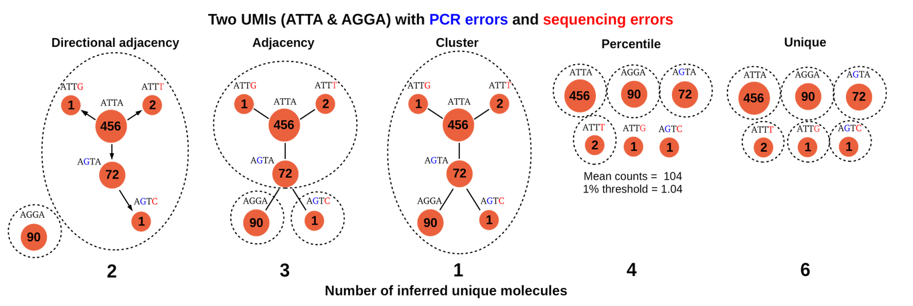
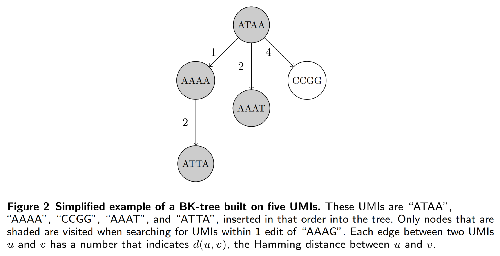
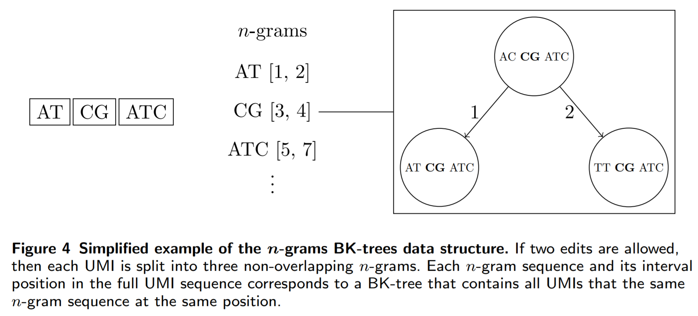
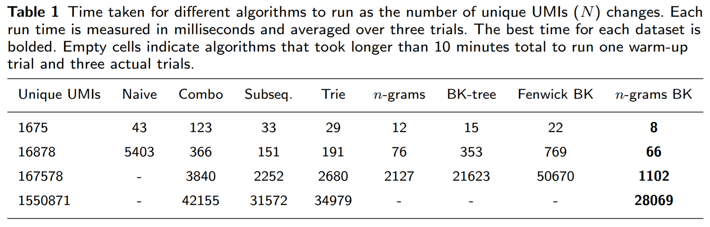
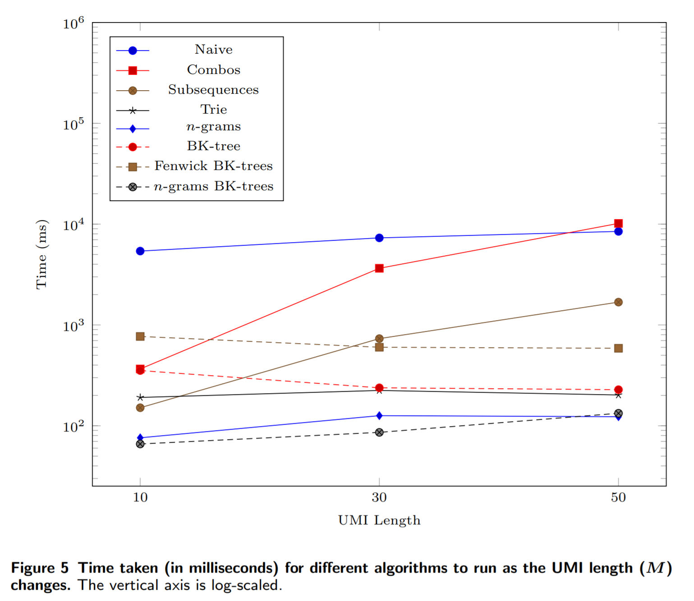
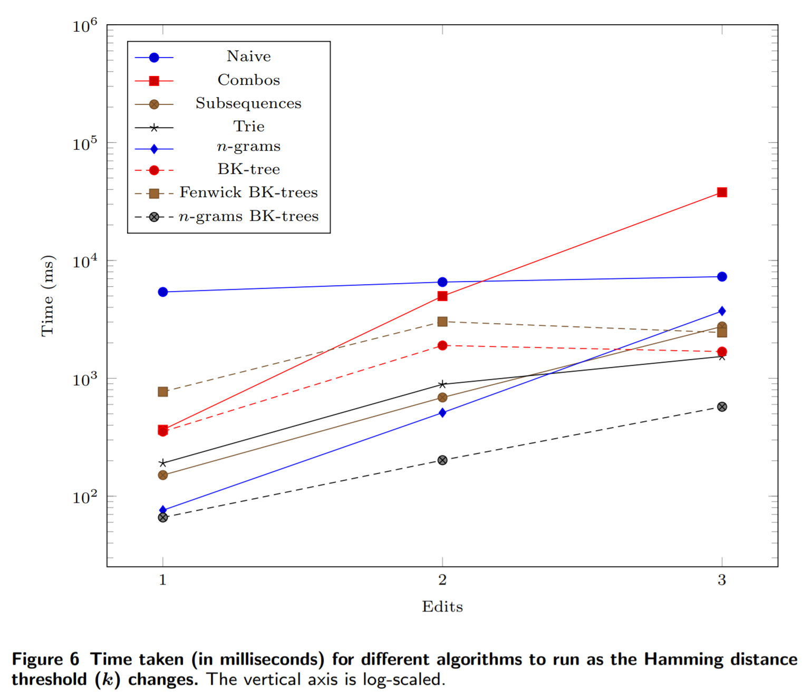
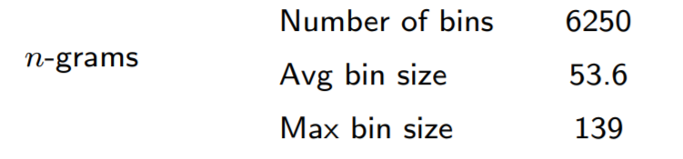

Creating a new algorithm or data structure is often not just one major insight, but a collection tricks that work together to produce better results. With that said, what kind of "better results" are we looking for? For computer scientists, this question often results in three answers: higher accuracy, faster speed, or lower memory footprint. In a recent [paper](https://www.biorxiv.org/content/10.1101/648683v2) ([code](https://github.com/Daniel-Liu-c0deb0t/UMICollapse)), I utilized this answer to explore the problem of efficiently deduplicating sequenced DNA reads with Unique Molecular Identifiers (UMIs) from a computer science perspective.

# A bit of background

Each UMI is a short, unique random sequence that corresponds to a certain DNA fragment. When PCR amplification is applied DNA fragments before sequencing, each DNA fragment is duplicated multiple times. UMIs allow us to figure out which sequenced reads are duplicates by grouping reads through their UMIs. The reason why we do not group using the DNA fragments themselves is because there may be multiple copies of the same DNA fragment before PCR amplification, and we want to be able to accurately count the duplicate DNA fragments. UMIs are applied in many experiments, including single-cell RNA sequencing.

As with many bioinformatics tasks that involve processing sequenced reads, the difficulty lies in handling sequencing and PCR amplification errors. Therefore, the deduplication task is just somehow grouping similar UMIs together, where similarity is defined by counting the number of mismatches between two UMI sequences. Since UMIs are used very often, this task has been thoroughly explored. Most notably, the "directional adjacency" method from [UMI-tools](https://genome.cshlp.org/content/early/2017/01/18/gr.209601.116.abstract) involves first obtaining the frequency of each unique UMI, and then grouping low frequency UMIs with high frequency UMIs. The main intuition behind this is idea is that UMIs that appear frequently have a very high chance of being correctly amplified and sequenced, while UMIs that appear less frequently are most likely wrong. This algorithm is discussed in more detail in [this](https://cgatoxford.wordpress.com/2015/08/14/unique-molecular-identifiers-the-problem-the-solution-and-the-proof/) blog post. An image comparison of different grouping algorithms, from the blog post:

Consider what happens for each UMI (which we will can the "queried" UMI): we need to quickly find UMIs that are similar to the queried UMI that also have a UMI frequency lower than our threshold. Let us call this step a single "query". After multiple queries, we build the full UMI graph as shown above by connecting the similar UMIs. Each connection is directional, so we connect higher frequency UMIs to lower frequency UMIs. Then, we need to group lower frequency UMIs together with the high frequency UMI using the graph, and we assume that the corresponding sequenced reads for the grouped UMIs all originate from the same DNA fragment.

# Improvements?

Applying the three things that computer scientists care about, we know that we can basically make three improvements to this process: make it more accurate, speed it up, or lower the memory footprint. We can attempt to improve the accuracy with a better algorithm than directional adjacency, but it is difficult without biological insights and actual experience with UMI data. Therefore, we are forced to settle on attempting to improve the other two areas while ensuring that we do not make any compromises on the accuracy of the directional adjacency algorithm. Directly attempting to lower the memory footprint is kind of pointless since we have to store all of the sequenced reads in memory no matter what, and most computers have a ton of memory anyways. Thus, the only option is to improve the speed of deduplication process while ensuring that the memory footprint does increase significantly.

The first step is identifying the bottleneck. There are two main time-consuming procedures in the directional adjacency algorithm: building the graph of UMIs and extracting groups of UMIs. Since each UMI can only belong to one group, then it is easy to see that extracting groups of UMIs from the graph only takes time linear to the number of unique UMIs. Building the graph naively requires comparisons between each pair of unique UMIs, which scales _quadratically_ with the number of UMIs. It turns out that many tools made for grouping UMIs use the naive method for building the graph, which leaves a lot of room for improvement.

# n-grams BK-trees: a medley of tricks

As a recap, our goal is to find a list of candidate UMIs that are similar to a queried UMI, and then narrow down the list to only UMIs that are low frequency. The exact frequency value of a "low frequency" UMI depends on the frequency of other UMIs, so in general we will narrow down the list of similar UMIs to only the low frequency UMIs with a fixed frequency threshold that represents the upper bound frequency. Now, we can figure out how to speed this up with different techniques.

## Trick 1: n-grams

The first trick we can apply is a simple and intuitive one. The idea is to decompose each UMI into multiple "fingerprints", and build a mapping from each fingerprint to a list of all UMIs that have that fingerprint. This fingerprint is simply a contiguous segment of the UMI, called a n-gram, and its location in the UMI. The only difficult part of this trick is how we select the segments to allow errors (mismatches) in the UMIs. It is not hard to see that if we want to allow up to $$k$$ errors, then we only need to split the UMIs into $$k + 1$$ n-grams. Therefore, for each queried UMI, we only need to search other UMIs that share at least one n-gram with the queried UMI. This allows us to prune UMIs by the number of errors we allow. The interesting part of this trick is that as the UMI length increases, each n-gram becomes longer, and thus rarer, and more UMIs can be pruned through this method.

## Trick 2: BK-trees

BK-trees are metric trees that partition the (in our case) space of all UMIs into shells. In other words, we pick a UMI and partition the UMI space into multiple shells of different radii that are centered around that picked UMI. The tree structure is constructed by repeatedly picking parent UMIs to partition the UMI space, and connecting each parent UMI to children UMIs that lie in each of the shells of different radii. For a more detailed walkthrough of how BK-trees work, read [this](https://signal-to-noise.xyz/post/bk-tree/) blog post, which contains an excellent introduction.

Here is an example of a BK-tree:

{:width="12cm"}

The main problem in the n-grams algorithm is that we have to check every single UMI that shares at least one n-gram with our queried UMI. Many of these UMIs may not be similar to our queried UMI, so it is definately a good idea to transform the list used in the n-grams method into something else, like a BK-tree. Then, each unique n-gram maps to a BK-tree that contains all of the UMIs associated with that n-gram, and we can prune even more UMIs from our search space. Here is an example of the n-grams BK-tree algorithm:

The main advantage of the n-grams BK-trees data structure over other "brute force" type algorithms that go through all possible errors that could occur in a UMI string is that it does not directly scale exponentially as the number of errors we allow or the UMI length increases.

## Trick 3: prune by frequency

A seemingly obvious property of trees is that once we know that each node in a subtree does not satisfy our criteria, we can just skip that entire subtree. If we compute the minimum frequency of all UMIs in each subtree in a BK-tree and save those values, then we can easily figure out whether a subtree contains at least one UMI with a frequency that is less than our fixed frequency threshold. With this, we can skip subtrees that only contains UMIs with frequencies greater than our threshold.

This property important because it hints that we should prune UMIs by frequency while searching for similar UMIs to build the UMI graph. We can avoid visiting UMIs in the BK-trees that are similar to our queried UMI, but have a UMI frequency higher than our frequency threshold, by keeping track of the minimum UMI frequency of each subtree in each BK-tree.

## Unused trick: sorting by frequency

Since we are pruning by frequencies, why not go one step further and also sort the UMIs by frequency before adding them one-by-one into the BK-trees? This allows lower frequency UMIs to be added closer to the root of the tree and higher frequency UMIs to be added near the leaves of the tree. As subtrees often mostly include UMIs that are far away from the root, it is more likely for a subtree to contain UMIs with frequencies higher than the threshold the farther away we get from the root. That means that more subtrees are pruned overall.

In the end, we will not use this when initializing the n-grams BK-trees data structure because it requires sorting the UMIs by frequency, which actually slows down the initialization step in practice.

## Trick 4: literally extract UMIs

So far, we are able to obtain the lower frequency UMIs that are similar to a queried higher frequency UMI. After querying with each UMI as the higher frequency UMI, we can build the directed graph of UMIs and group UMIs through the directional adjacency algorithm. However, notice that in the end, each UMI can only belong to one single group. Therefore, we are actually wasting time explicitly building the UMI graph, because after adding an UMI to a group in the directional adjacency algorithm, we do not ever need to revisit that UMI again. All of the extra edges leading to that UMI, which we painstakingly calculated through multiple queries, are essentially useless.

So why do even build the graph in the first place if we do not use most of it? Why not just make the UMI graph _implicit_, so we compute the edges we need? This actually works, and it basically means that we remove UMIs from our BK-trees after each query. Therefore, UMIs that are added to a group in a previous query are actually removed and skipped in later queries. Since the UMI graph is not explicitly constructed, we need to merge the graph construction and UMI extraction/grouping steps of the directional adjacency algorithm together.

## Trick 5: special encoding

With two strings of nucleotides (A, T, C, or G) of length $$M$$, we can compute the Hamming distance (how we measure similarity) in exactly $$O(M)$$ time. At first it seems unlikely, but _can we do better_? The answer is actually yes!

Usually, the encoding method for nucleotides is mapping them to binary: 00, 01, 10, and 11. This is the best we can do if we optimize for size. The problem with this encoding is that we cannot easily find the Hamming distance for two arbitrary strings encoded with them. If we optimize for the speed of computing Hamming distance, we can actually get a different set of encodings: 011, 110, 101, 000. The special property of this set of encodings is that the bitwise Hamming distance between each pair of encodings is exactly 2 (try it; count the number of different bits between each pair). This means that we can easily infer the Hamming distance between two strings of nucleotides when they are encoded with that encoding by calculating the bitwise Hamming distance.

The reason why we can get faster than $$O(M)$$ Hamming distance computation is because we can pack a bunch of nucleotides into a single 64-bit computer word. In fact, since computing the bitwise Hamming distance is constant-time (XOR + POPCOUNT operations), we can compute the Hamming distance between two 21 nucleotide strings in constant-time! Note that encoding a nucleotide string still takes $$O(M)$$ time so this is only beneficial if multiple Hamming comparisons are made. By packing a bunch of nucleotides into one computer word, we can also make hashing and other comparison operations constant-time.

## Implementation trick: reducing copies

When we split UMIs into n-grams, we can avoid copying the pieces of the UMI multiple times by using views on the UMIs. A view basically represents a contiguous segment of an UMI string with only the start and end locations of the segment, which is backed by a reference to the original UMI. We can also cache the hash for each view so we do not need to recalculate it.

# Performance in practice

It is important to remember that the tricks for speeding up UMI deduplication may _degrade_ performance compared to other algorithms on very small datasets. This is completely expected, since there are overheads associated with using those tricks.

First, let us see how fast the n-grams BK-trees method performs runs compared to other methods as the number of unique UMIs increases:

The n-grams BK-trees method is able to make use of the benefits of both the n-grams and the BK-tree methods (individually), as it performs better.

If we increase the length of the UMIs, then we see that it ties with the n-grams method:

If we increase the number of errors allowed, then the n-grams BK-trees method scales much more favorably compared to other methods:

Note that in all three experiments, we use simulated (randomly generated) datasets. In practice, when there are less UMIs at a single alignment coordinate, the n-grams BK-trees method does not result in such a dramatic gains in performance.

For a little more information about the n-grams BK-tree data structure, we can look at some statistics about the n-grams with more than 160,000 UMIs:

We can see that the n-grams method is able to prune a significant portion of the UMIs. The largest BK-tree is only built on around 140 UMIs.

# Conclusion

The n-grams BK-trees method is essentially a bag of all sorts of tricks for speeding up the UMI deduplication task. However, in general, finding similar strings to a queried string is very useful in a variety of applications. It is vital in natural language processing and bioinformatics tasks that involve clustering and grouping similar strings. Perhaps the insights and tricks behind the n-grams BK-trees method can be applied to accurately finding similar strings under the Hamming distance metric for other tasks.
