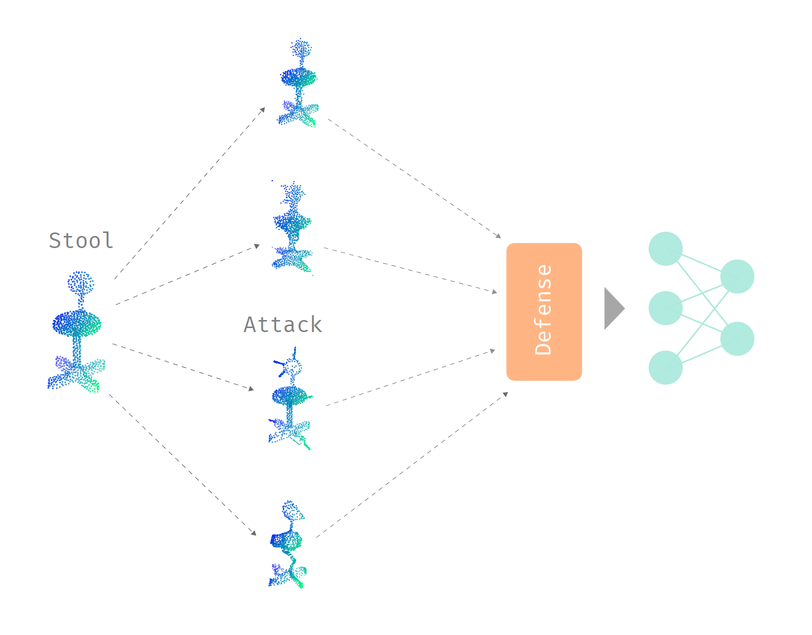

An interesting phenomenon with neural networks is that it is incredibly easy to perturb or change the input by a little amount, and cause the network to make a completely different prediction. In general, this field of adversarial machine learning contains two main problems that everyone is slowly chipping away at:

- How can we attack neural networks with a bounded amount of change/perturbation to the input, under a certain metric?
- How can we (empirically or provably) defend neural networks against adversarial attacks?

Currently, this is a perpetual tug of war between the attacker and the defender. There is a lot of work on both attacking and defending, particularly because coming up with an efficient and provably robust defensive method against all attacks is very difficult.

{:width="500px"}

Even in the rapidly expanding field of machine learning, there are stones left unturned. In the short timespan of one year, I was fortunate enough to contribute to the birth of a new subsubfield examining the adversarial robustness of neural networks that learn from 3D point sets. This was incredibly exciting---I got to witness the development and maturation of ideas in a field with many opportunities by participating _first-hand_!

In this post, I will highlight some interesting ideas born through the intersection of 3D machine learning and adversarial machine learning. This will mostly cover the two papers ([first](https://arxiv.org/abs/1901.03006) and [second](https://arxiv.org/abs/1908.06062) papers) I contributed to the field along with my mentors Ronald Yu and Hao Su, and also some work by groups all over the world. I will also provide evaluations of the plausibility and effectiveness of different ideas, especially for defending against adversarial attacks, which is prone to unintentional errors.

# Name of the game

Before we dive into the ideas for attacking and defending 3D neural networks, let us examine what kind of ideas we want to extract in this field. Since we are examining 3D point clouds and neural networks built especially for them, we want to create attacks and defenses that are native to 3D point clouds. We can create attacks and defenses that are universal to all types of inputs, but then we would have to "compete" with previously proposed ideas. If we merely apply ideas that were used for 2D images, which are studied more thoroughly, to 3D space, then we are not bringing major contributions to the table. Therefore, we want to exploit the special properties of both 3D point clouds and the point cloud neural networks in our journey of attacking and defending.

Now, let us go over a little background on 3D point clouds and their neural networks.

## Point clouds

A 3D point cloud provides an approximation of a 3D object's shape. This shape is only the boundary of a 3D object, so it is hollow. If we represent the true shape as an infinite set of points $$S$$, then we have $$x \subset S$$ for a point cloud $$x$$. For simplicity, we will assume that $$x$$ is evenly sampled from the true shape. When point clouds are obtained through scanning objects in the real world (LiDAR and RGB-D scans, or photogrammetry), they are usually uneven and partially occluded.

3D point clouds differ from 2D images in a few ways:
1. The order of points does not matter.
2. Shape, instead of color, is represented. Along with the assumed even sampling of points, this means that there is exploitable structure in 3D point clouds.
3. Randomly moving the points by a small amount, dropping a few points, and adding a few points on the true shape should still represents the same object.

## Learning in 3D space

The challenge of learning in 3D space is to deal with the order and density invariance of point clouds. The general idea of the popular [PointNet](https://arxiv.org/abs/1612.00593) architecture is to apply the classical multi-layer perceptron (multiplication by weight matrix) for each point _separately_. From the three color channels of each point, we use multiple layers of matrix multiplication to obtain 1024 features. Then, max pooling is applied elementwise across the 1024-dimensional feature vectors of each point. Since the max operation is symmetrical, this is invariant to the order of points in a point set. Many other architectures basically just extend this idea with subsampling and other ideas.

For density invariance, the PointNet architecture only selects a set of "critical" points from the entire input point set with the max pooling operation. This set of critical points form the skeleton of the point cloud, and the rest of the points are basically ignored by the network.

# Basic attacks in 3D

The most straightforward attack is by using gradient descent to directly perturb the position of each point. We are essentially solving the following optimization problem for a point cloud $$x$$:

$$
\begin{align}
&\text{maximize}& &J(f_\theta(x + \delta), y)\\
&\text{subject to}& &||\delta||_p \leq \epsilon
\end{align}
$$

$$J$$ represents the loss function, $$y$$ is the label class, and $$f_\theta$$ is a neural network parameterized by $$\theta$$. Notice that the perturbation $$\delta$$ is bounded by $$\epsilon$$ under the $$L_p$$ norm, and we do not clip $$x + \delta$$ because unlike 2D image color channels, the positions of 3D points are unbounded. The $$L_p$$ norm also provides a way for us to measure the perceptibility of adversarial perturbations.

Just like with 2D images, this method works very well for generating adversarial attacks. Here are visualizations of adversarial perturbations (bounded with the $$L_2$$ norm) on a car and a person from the ModelNet40 dataset:

{:width="250px"}{:width="250px"}

The perturbed points are orange.

A simple extension to this is to ensure that each point is perturbed by the same amount by normalizing the perturbation vector for each point. Also, it is possible to add a few new points and perturb them instead of perturbing the original points in the point cloud (for example, [here](https://arxiv.org/abs/1809.07016) and [here](https://arxiv.org/abs/1902.10899)).

# Defense: removing outliers

Right away, we notice that constraining the perturbations using the $$L_2$$ norm results in some points being perturbed more than others, and those points become outliers in the point set. Therefore, a simple defense would be to just remove those outlier points. A common method for identifying outliers is based on each point and its $$k$$-nearest neighbors. Finding points that are outliers is done by examining the distribution of distances between each point and its nearest neighbors. Afterwards, the outlier points that are too far away from its $$k$$-nearest neigbors are removed from the point set.

Removing outliers is actually very effective as a defense---it performs much better than adversarial training, a classical defense that involves teaching a neural network the correct labels for adversarial examples. In practice, removing outliers works well even if we constrain the amount of perturbation to each _point_ by an $$\epsilon$$ so that large perturbations are not possible. The perturbation of each point can even contrained to the average distance between each point and its nearest neighbor in the clean point cloud, and outlier removal would still work.

Interestingly, this method was proposed in parallel in many different papers on defending against adversarial attacks on point clouds. I guess everyone noticed the outliers generated by adversarial perturbations. The simpler method of randomly removing points was also proposed multiple times.

# Defense: removing salient points

Since we perturb points by their gradients, it makes sense to remove adversarial points by examining their gradients to hopefully restore the point cloud of an object. The idea is to first calculate the saliency of each point (at index $$i$$ in $$x$$) through

$$
s[i] = \max_j ||(\nabla_{x^\ast} f_\theta(x^\ast)[j])[i]||_2
$$

where $$x^\ast = x + \delta$$.

Then, we can sort the points by their saliencies and remove points with high saliencies. In other words, points that have large saliencies, which are the magnitudes of the gradient of each output class with respect to each point, are removed. In practice, this works well as a defense, and it performs better than adversarial training. This defense avoids the issue of being unable to identify adversarial points if there are no outliers, but we are making the assumption that points with large magnitudes of gradients are the perturbed points.

# Defense: limitations

The reason why removing points performs so well is actually due them relying on gradient masking. The max pooling operation in PointNet ignores a set of points, which causes them to not get any gradient flow. These points cannot be perturbed with gradient-based methods, so they can accurately represent the unperturbed shape of a point cloud once the perturbed points are removed. However, relying on masked gradients does not lead to truly robust models, as we will see in the shape attacks that are proposed later.

# Minimizing the perceptibility of perturbations

So far, when we perturb a point cloud, we do not really take into account the intrinsic shape that it represents with the $$L_p$$ norms. Therefore, it may prove fruitful to examine some other metrics for measuring the perturbation on 3D point clouds. One such metric is the Hausdorff distance between two sets:

$$
\mathcal{H}(A, B) = \max_{a \in A} \min_{b \in B} ||b - a||_2
$$

This is actually not technically a metric, but it enables us to measure the distance between a perturbed point set $$A$$ and a clean point set $$B$$. In words, the Hausdorff distance is defined as the the maximum distance between each point in $$A$$ and its closest point in $$B$$. For an adversarial point set $$x^\ast$$, we have two ways of using the Hausdorff distance:

1. $$\mathcal{H}(x^\ast, x)$$: comparing the adversarial point cloud to the clean point cloud. The advantage of this over the $$L_p$$ norms is that it allows the positions of two points to be swapped, making it a much more natural metric for 3D point clouds that are order-invariant. This was proposed in [this paper](https://arxiv.org/abs/1809.07016).
2. $$\mathcal{H}(x^\ast, S)$$: comparing the adversarial point cloud to the true shape of the point cloud $$x$$. This takes into the account the shape of the point cloud, and is point density invariant. This was proposed in my papers.

To maximize the loss of the neural network while ensuring that $$\mathcal{H}(x^\ast, S) \leq \epsilon$$, we can use projected gradient descent to project the perturbation of each point onto the 3D object that the point clouds were sampled from. If the 3D object is unavailable, we can use a triangulation algorithm, like the alpha shapes algorithm, to infer the object shape. For faster projection speed, we can build some metric tree, like the VP-tree, on the triangular mesh, by representing each triangle as a point. I call this method the "distributional attack", since it changes the distribution of points near the shape of an 3D object. The great thing about this method is that we can generate perturbations with $$\mathcal{H}(x^\ast, S) = 0$$, which means that we only move the points around on the shape $$S$$. If the 3D object is available, this creates _very_ imperceptible perturbations, and it reaches around 25% success rate on PointNet/PointNet++. Even with a slightly higher Hausdorff distance and an approximated surface $$S$$, the perturbations remain imperceptible, while the success rate of the attack becomes much higher (>80%).

Here is a visualization of the distributional attack on an approximated shape, with a small Hausdorff distance:

{:width="250px"}

Here is a visualization with the true shape and a Hausdorff distance of exactly zero, with perturbed points in orange:

{:width="250px"}

Although the perturbation of each point is very small and kept on the shape of the object, removing points is effective as a defense against this type of attack.

# Shape attacks

In addition to constraining the Hausdorff distance, we can add another constraint to ensure an uniform density distribution of points after perturbing points. Therefore, the perturbations must change the overall shape of an point cloud, since small changes to the point distribution are not allowed. This is more realistic than having a few points suspended in mid-air, far away from the main 3D object. Also, it is easier to control the shape than the distribution of points obtained through a scanner. Shape attacks are also effective against point removal defenses, as they modify or destroy the density information that outlier removal relies on, and removing a few points from a perturbed shape does not make it clean again.

## Perturbation Resampling

We can express the idea of having the points $$x^\ast$$ evenly distributed on a shape $$S^\ast$$ as an optimization problem maximizing the distance between points:

$$
\begin{align}
&\text{maximize}& &\min_{i \in \{1 \ldots N\}} \min_{j \in \{1 \ldots N\}\setminus\{i\}} ||x^\ast[j] - x^\ast[i]||_2\\
&\text{subject to}& &x^\ast \subset S^\ast
\end{align}
$$

However, we do not need to solve this problem exactly; a greedy approximation using farthest point sampling works fine. The perturbation resampling attack is simple: just perturb points using gradient descent, but resample a portion of the points on the estimated adversarial shape that is determined by the perturbed points.

The final result is

{:width="250px"}

Note that sometimes, the perturbation of a point is so large that the triangulation algorithm cannot include it in the triangulation, so it becomes an outlier.

## Adversarial Sticks

We can also add new adversarial features to the shape of the point cloud. In [this paper](https://arxiv.org/abs/1809.07016), they propose adding new clusters of points, or even smaller versions of other point clouds that float in mid-air, near a clean point cloud. We take a simpler and more realistic route by adding a few sticks, or line segments, that are attached to the shape of the clean point cloud. Then, the adversarial object will look like a porcupine. Conceptually, we need to figure out where to place the sticks on an object, and the length/direction of each stick. Formally, we are solving the following optimization problem:

$$
\begin{align}
&\text{maximize}_{\alpha, \beta}& &J(f_\theta(x \cup \mathcal{S}_\kappa(\alpha, \beta)), y)\\
&\text{subject to}& &||\beta||_2 \leq \epsilon,\\
&&&\alpha \subset S
\end{align}
$$

$$\alpha$$ is a set of points representing where the sticks are attached to the shape $$S$$, $$\beta$$ is a set of vectors representing the orientation of each stick, and $$\mathcal{S}_\kappa$$ returns a set of $$\kappa$$ points sampled on the sticks.

Like perturbation resampling, we can just approximate this by first perturbing _points_ using gradient descent, and then connecting those points to the closest point on the surface of a 3D object at the end. Finally, we need to sample points on the adversarial sticks. A visualization of the result is:

{:width="250px"}

## Adversarial Sinks

With our previous techniques, we need to resample points during gradient descent. This works, but it feels like a weird hack. So is there a fully differentiable way to perturb the shape of a point cloud?

Let us assume that we have a few guide points ($$s_f$$) for this perturbation process. We also have $$s_0 \subset x$$, which are the starting point positions for $$s_f$$. Then, we can perturb points on the shape by attracting them to the sink points $$s_f$$. This attraction falls off over distance according to the Gaussian radial basis function:

$$
\phi_{\mu'} = e^{-(\frac{r}{\mu'})^2}
$$

The idea is similar to perturbing a few points separately through basic gradient descent, but since the sink points have attraction, they modify the overall shape of the point cloud. Each point is affected by the sum of the attractions of the $$\sigma$$ sink points:

$$
x^\ast = x + \tanh\big(\sum_{j = 1}^\sigma (s_f[j] - x[i]) \phi_{\mu'} (||s_0[j] - x[i]||_2)\big), \quad\forall i \in \{1 \ldots N\}
$$

where $$\mu'$$ is

$$
\mu' = \frac{\mu}{N} \sum_{i = 1}^N \min_{j \in \{1 \ldots N\}\{i\}} ||x[j] - x[i]||_2
$$

to ensure that the tunable attraction falloff relies of the distribution of points. Note that the $$\tanh$$ is used to clip the perturbations. Since the entire perturbation expression is differentiable, we can use something like Adam to maximize the loss while minimizing the perturbation. A visualization of the result:

{:width="250px"}

This method is my favorite out of all the shape attacks because it is fully differentiable, so it feels "clean" and not as hacky as resampling points. It was inspired by black holes due to my interest in strange physics stuff like quantum mechanics and spacetime.

For a quick run down of all the attacks proposed in my second paper, just look at this graphic:

{:width="800px"}

# Removing points as an attack

Another avenue for attacking point clouds is through _removing_ points ([this](https://arxiv.org/abs/1812.01687) and [this](https://arxiv.org/abs/1902.10899) papers). This is done by dropping points that are part of the critical point set that contribute to decreasing the loss between the model output and the correct class. The saliency (gradient) is used to find these critical points. Note that this idea is very similar to the defense method of removing salient points.

Obviously, removing more points as a defense will not help point clouds that are attacked through point removal. However, this attack is not realistic, as it is difficult to control the lost points from point clouds that are directly scanned from 3D objects.

As a side note, I did independently come up with a similar method to this a long time ago (it is still in my code), but I did not test multiple iterations of this attack, so it did not perform very well, causing me to unfortunately scrap the idea. This idea of removing points is quite popular, and similar attacks has been proposed independently multiple times.

An upsampling network ([this paper](https://arxiv.org/abs/1812.11017)) can be used to defend against adversarially removed points, but it is quite easy to also attack the upsampling network, since it is fully differentiable anyways.

# Beyond 3D point sets

Point clouds are easy to perturb because changing the numerical values in the input point set directly changes the point locations. For attacking other formats like voxels, it may be easier to first convert them to point clouds before perturbing them.

# Conclusion and future directions

So far, creating truly robust defenses by using information exclusive to 3D point clouds, like point density, is still an open problem. In the beginning, we would think that 3D space is somehow more easily defensible than 2D space, but my later work showed that this is not true. 3D space and 2D space have different strengths and vulnerabilities, and there are attacks and defenses that are exclusive to one domain but not the other. As with many work on defenses in 2D, creating defenses that are robust in 3D space is not an easy task---it is quite easy to attack the assumptions that are made in certain defense techniques. From my short journey through adversarial machine learning, I envision the truly robust defense methods to be mathematically provable and domain-agnostic, so they do not need to make use of domain-specific properties (like the distribution of points) that may be easily circumvented.

I did not expect that many ideas would be proposed in parallel. When I worked on my papers, I scoured arXiv for any possible related papers, so I can ensure that my work was truly novel. In my latest [paper](https://arxiv.org/abs/1908.06062), I tried my best to come up with a large quantity of out-of-the-box ideas and make use of triangulation and tree algorithms to be unique. Finally, even I am surprised by the number of ideas proposed in just two of my papers!